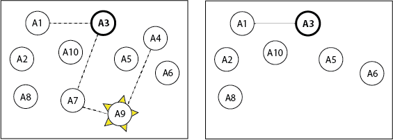

# Error Handling

```@meta
CurrentModule = Actors
```

`Actors` provides Erlang/OTP-like [^1][^2] mechanisms and message protocols to

1. handle errors in actors and tasks and to
2. write fault-tolerant programs.

The basic philosophy is not to defend against errors but to detect them and then to take action about them. There are two basic mechanisms for that: *connections* and *monitors*:

## Connections

If you [`connect`](@ref) actors, they send each other [`Exit`](@ref) messages when they fail, [`stop`](@ref) or [`exit!`](@ref). An actor propagates an `Exit` message to all its connected actors and then terminates

- if the exit reason is other than `:normal`,
- and if it is not `:sticky`.

With [`trapExit`](@ref) an actor can be made `:sticky`. When it then receives an `Exit` message with a reason other than `:normal`, it will

- not propagate it and not terminate but
- give a warning about it and
- store a link to the failed actor.

Connections between actors are always bidirectional and can be [`disconnect`](@ref)ed. You can build a chain or network of connected actors that depend on each other and exit together. A `:sticky` actor operates as a firewall among connected actors.



Assume in an actor system `A1`-`A3`-`A7`-`A9`-`A4` are connected, `A3` is a `:sticky` actor and `A9` fails. Before it terminates, it sends an `Exit` message to `A4` and `A10`. `A10` propagates it further to `A3`. `A9`, `A4` and `A10` die together. `A3` gives a warning about the failure and saves the link to the failed actor `A9`. `A3` does not propagate the `Exit` to `A1`. Both `A1` and `A3` stay connected and continue to operate. The other actors are separate and are not affected by the failure. This is called "graceful degradation".

## Monitors

An actor can be told to [`monitor`](@ref) other actors or Julia tasks. Monitored actors or tasks send a [`Down`](@ref) message to their monitor(s) before they terminate. A monitor then gives a warning or executes a specified action.

Monitors do not forward `Down` messages. They give warnings or execute specified actions for `Down` signals (even with reason `:normal`). Monitoring is not bidirectional. If a monitor fails, the monitored actor gets no notification. Monitoring can be stopped with [`demonitor`](@ref).

### Using connections and monitors

If `connect` or `monitor` are called from the REPL or a user script and not from an actor, the given link will be connected to or monitored by the `Actors._ROOT` actor.

Connections and monitors represent quite different protocols. When do you use which? If you want a failure in one actor to terminate others, then setup a connection. If instead you need to know or take action when some other actor or task exits for any reason, choose a monitor. Both approaches can be combined to realize arbitrary structures of connected and monitored actors.

Of course actors with complicated and error-prone behaviors should not be made monitors or `:sticky` actors.

## Supervisors

- task supervision
- supervision tree

[^1]: The definitive source for an outline of actor-based error handling is Joe Armstrong's dissertation: [Making reliable distributed systems in the presence of software errors](https://erlang.org/download/armstrong_thesis_2003.pdf)
[^2]: For implementation see also Joe Armstrong 2013. Programming Erlang, 2nd ed: Software for a Concurrent World; Manning, chs. 13 and 23 as well as the [Erlang/OTP](https://www.erlang.org/docs) and [Elixir](https://elixir-lang.org/docs.html) online documentations.
