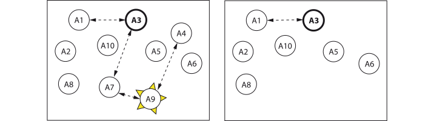

# Error Handling

```@meta
CurrentModule = Actors
```

`Actors` provides Erlang/OTP-like [^1][^2] mechanisms and message protocols to

1. handle errors in actors and tasks and to
2. write fault-tolerant programs.

The basic philosophy is not to defend against errors but to detect them and then to take action about them. There are two basic mechanisms for that: *connections* and *monitors*:

## Connections

If you [`connect`](@ref) actors, they send each other [`Exit`](@ref) messages when they fail, [`stop`](@ref) or [`exit!`](@ref). An actor propagates an `Exit` message to all its connected actors and then terminates

- if the exit reason is other than `:normal`,
- and if it is not `:sticky`.

With [`trapExit`](@ref) an actor can be made `:sticky`. When it then receives an `Exit` message with a reason other than `:normal`, it will

- not propagate it and not terminate but
- give a warning about it and
- store a link to the failed actor.

Connections between actors are always bidirectional and can be [`disconnect`](@ref)ed. You can build a chain or network of connected actors that depend on each other and exit together. A `:sticky` actor operates as a firewall among connected actors.



Assume in an actor system `A1`-`A3`-`A7`-`A9`-`A4` are connected, `A3` is a `:sticky` actor and `A9` fails. Before it terminates, it sends an `Exit` message to `A4` and `A7`. `A7` propagates it further to `A3`. `A9`, `A4` and `A7` die together. `A3` gives a warning about the failure and saves the link to the failed actor `A9`. `A3` does not propagate the `Exit` to `A1`. Both `A1` and `A3` stay connected and continue to operate. The other actors are separate and are not affected by the failure.

## Monitors

An actor can be told to [`monitor`](@ref) other actors or Julia tasks. Monitored actors or tasks send a [`Down`](@ref) message with an exit reason to their monitor(s) before they terminate. A monitor then gives a warning or executes a specified action dispatched on the received reason.


`A3` is a monitor. It gets a `Down` signal from its monitored actors if they exit.

Monitors do not forward `Down` messages. They give warnings or execute specified actions for `Down` signals (even with reason `:normal`). Monitoring is not bidirectional. If a monitor fails, the monitored actor gets no notification. Monitoring can be stopped with [`demonitor`](@ref). An actor can have several monitors (if that makes sense).

## Supervisors

A supervisor is an actor looking after child actors and restarting them as necessary when they exit.


In the depicted case the supervisor `A10` has child actors `A1`-`A6`. What it does if one of them – say `A4` - exits, is determined by its supervision strategy and by the child's restart variable and exit reason.

### Supervision strategy

| strategy | brief description |
|:---------|:------------------|
| `:one_for_one` | only the terminated actor is restarted (`A4`), |
| `:one_for_all` | all other child actors are terminated, then all child actors are restarted (`A1`-`A6`), |
| `:rest_for_one` | the children started after the terminated one are terminated, then all terminated ones are restarted (`A4`-`A6`). |

### Child restart options

| restart option | brief description |
|:---------------|:------------------|
| `:permanent` |  the child actor is always restarted, |
| `:temporary` | the child is never restarted, regardless of the supervision strategy, |
| `:transient` | the child is restarted only if it terminates abnormally, i.e., with an exit reason other than `:normal` or `:shutdown`. |

Supervisors allow for more automation and control of error handling in an actor system. For that they have the following API:

| API function | brief description |
|:-------------|:------------------|
| [`supervisor`](@ref) | start a supervisor actor, |
| [`supervise`](@ref) | add the current actor to a supervisor's child list, |
| [`unsupervise`](@ref) | delete the current actor from a supervisor's child list, |
| [`start_actor`](@ref) | tell a supervisor to start an actor as a child, |
| [`start_task`](@ref) | tell a supervisor to start a task as a child, |
| [`delete_child`](@ref) | tell a supervisor to remove an actor from its child list, |
| [`terminate_child`](@ref) | tell a supervisor to terminate a child and to remove it from its child list, |
| [`count_children`](@ref) | tell a supervisor to return a children count, |
| [`which_children`](@ref) | tell a supervisor to return a list of its children. |

With options we can limit how often a supervisor tries to restart children in a given timeframe. If it exceeds this limit, it terminates itself and all of its children with a warning.

## The `_ROOT` Actor

If `connect` or `monitor` are called from the REPL or a user script and not from an actor, the given link will be connected to or monitored by the `Actors._ROOT` actor.

## Fault Tolerance

To use the above mechanisms for fault-tolerance successfully, supervisors, monitors or `:sticky` actors must have behaviors which are unlikely to fail.
Therefore actors with complicated and error-prone behaviors should not be made monitors or `:sticky`.

Connections, monitors and supervisors represent quite different protocols. When do you use which?

1. If you want a failure in one actor to terminate others, then use [`connect`](@ref).
2. If instead you need to know or take action when some other actor or task exits for any reason, choose a monitor.
3. If you want to realize a hierarchy of actors and tasks, use supervisors.

The approaches can be combined to realize arbitrary structures of connected and monitored actors.

### Supervisory trees

Often you may be interested in building a hierarchical structure containing all actors and tasks in your application. This is called a supervisory tree, and there is the [`Supervisors`](https://github.com/JuliaActors/Supervisors.jl) package facilitating to build that.

[^1]: The definitive source for an outline of actor-based error handling is Joe Armstrong's dissertation: [Making reliable distributed systems in the presence of software errors](https://erlang.org/download/armstrong_thesis_2003.pdf)
[^2]: For implementation see also Joe Armstrong 2013. Programming Erlang, 2nd ed: Software for a Concurrent World; Manning, chs. 13 and 23 as well as the [Erlang/OTP](https://www.erlang.org/docs) and [Elixir](https://elixir-lang.org/docs.html) online documentations.
