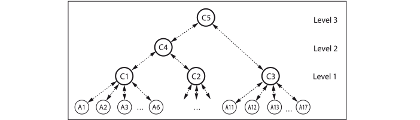

# Checkpointing

```@meta
CurrentModule = Actors
```

`Actors` provides a simple mechanism for taking user-defined checkpoints/copies of variables and restoring them on demand. This can be used together with actor and task supervision to restart failed computations from a previously saved state.

Why do we need checkpointing in addition to supervision? If for example a computing node fails, a supervisor does not receive an error message with the last state of a failed actor. It must be able to restart an actor on another node with a state saved somewhere else.

!!! note "This is experimental and in active development!"
    
    We conceive actor-based checkpointing as sending copies of variables over a link (a Channel) to a `checkpointing` actor. There is no stopping of an actor/task/process/application from the outer system or taking copies of an actors' (shared) state. 
    
    The user must `checkpoint` critical variables regularly and `restore` them within `init!` and `restart` callbacks (described in [supervision](supervisors.md)). This enables computations to recover from node failures. We must develop appropriate patterns for using this kind of checkpointing.

## Multi-level Checkpointing

Checkpointing actors can be grouped into a hierarchy of several levels. This allows their subordinated actors or tasks to be restarted from a common state. This is similar a kind of multi-level checkpointing:

> Multi-level checkpointing ... uses multiple types of checkpoints that have different levels of resiliency and cost in a single application run. The slowest but most resilient level writes to the parallel file system, which can withstand a failure of an entire machine. Faster but less resilient checkpoint levels utilize node-local storage, such as RAM, Flash or disk, and apply cross-node redundancy schemes. [^1]

All checkpointing actors have a `Dict` (in-memory) for checkpoints, which they can save to a file and reload. They are isolated from one another and their location (e.g. a worker pid) can be chosen according to redundancy and efficiency considerations.

A hierarchy of checkpointing actors may look like the following:



`C1` .. `C3` take level 1 checkpoints from connected worker actors `A1` .. `A17`. `C4` is at level 2 and updates regularly its dictionary from checkpoints of actors `A1` .. `A10`. `C5` updates regularly from `C3` and `C4`. Depending on the failure and the supervisory strategy the system can recover from checkpoints on various levels. Maybe `C5` saves its checkpoints to disk. Thus the whole system could be restarted from that.

## Level One

A [`checkpointing`](@ref) actor at `level=1` operates as server for worker actors or tasks. On [`checkpoint`](@ref) it stores values from current computations under a key and can [`restore`](@ref) them on demand. It usually resides on the same node as its clients and can take frequent and inexpensive checkpoints.

## Higher levels

Checkpointing actors at levels > 1 aggregate and save checkpoints from actors below them periodically or at demand. They usually reside on other nodes and save checkpoints to a file system. If desired, the highest level actor can save and serve the checkpoints of an entire distributed application.

## Checkpointing API

| API function | brief description |
|:-------------|:------------------|
| [`checkpointing`](@ref) | start a checkpointing actor, |
| [`checkpoint`](@ref) | tell it to take a checkpoint, |
| [`restore`](@ref) | tell it to restore the last checkpoint, |
| [`register_checkpoint`](@ref) | register it to another higher level one, |
| [`@chkey`](@ref) | build a checkpointing key, |
| [`set_interval`](@ref) | set the checkpointing periods, |
| [`get_interval`](@ref) | get the checkpointing periods, |
| [`start_checkpointing`](@ref) | start periodic checkpointing, |
| [`stop_checkpointing`](@ref) | stop the periodic checkpointing, |
| [`get_checkpoints`](@ref) | get (a `Dict` of) all checkpoints, |
| [`save_checkpoints`](@ref) | tell it to save the checkpoints to a file, |
| [`load_checkpoints`](@ref) | tell it to load them from a file. |

[^1]: Adam Moody, Greg Bronevetsky, Kathryn Mohror, Bronis R. de Supinski, [Design, Modeling, and Evaluation of a Scalable Multi-level Checkpointing System](https://dl.acm.org/doi/10.1109/SC.2010.18), LLNL-CONF-427742, Supercomputing 2010, New Orleans, LA, November 2010.