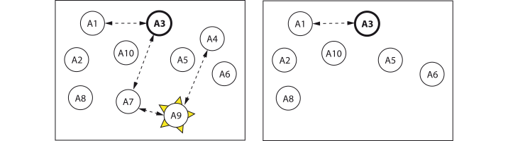

# Connections

```@meta
CurrentModule = Actors
```

If you have actors depending on each other, you may want them to exit together if one of them terminates. Therefore you can [`connect`](@ref) them as peers. Then an actor will send an [`Exit`](@ref) message to its connected actors. Those propagate the `Exit` message (caused by a failure, [`stop`](@ref) or [`exit!`](@ref)) to their connected actors and then terminate

- if the exit `reason` is other than `:normal`,
- and if they are not `:sticky`.

With [`trapExit`](@ref) an actor can be made `:sticky`. When it then receives an `Exit` message with a reason other than `:normal`, it will

- not propagate it and not terminate but
- give a warning about it and
- store a link to the failed actor.

Connections between actors are always bidirectional and can be [`disconnect`](@ref)ed. You can build a chain or network of connected actors that depend on each other and exit together. A `:sticky` actor operates as a firewall among connected actors.



Assume in an actor system `A1`-`A3`-`A7`-`A9`-`A4` are connected, `A3` is a `:sticky` actor and `A9` fails. Before it terminates, it sends an `Exit` message to `A4` and `A7`. `A7` propagates it further to `A3`. `A9`, `A4` and `A7` die together. `A3` gives a warning about the failure and saves the link to the failed actor `A9`. `A3` does not propagate the `Exit` to `A1`. Both `A1` and `A3` stay connected and continue to operate. The other actors are separate and are not affected by the failure.

See a Julia script illustrating the above system in the [How-to section](@ref connect).
