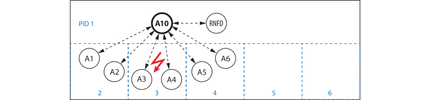
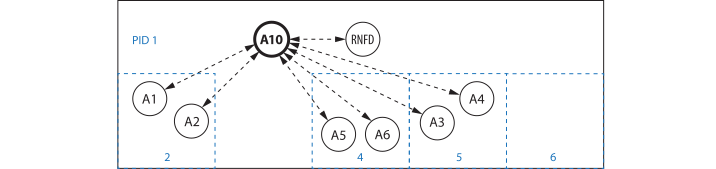

# Node Failures

```@meta
CurrentModule = Actors
```

In distributed computing node failures can occur. The occurrence of a single node failure is not very likely but node failures can be a problem for long running applications executed on many nodes.

## Remote failure detection

If an actor with a remote link is put under supervision (under a supervisor running on another worker), the supervisor starts a special child actor (RNFD: remote note failure detection) checking remote links periodically for node failures.

If it detects a `ProcessExitedException` on a supervised `RemoteChannel`, it sends a `NodeFailure` signal to the supervisor. The supervisor then handles it as if an actor failure had occurred.

## Actor restart on spare nodes

Generally a supervisor restarts a failed remote (`:transient` or `:permanent`) child actor on the same `pid` (process id) where it ran before failure. But in case of a worker failure the actors that ran on it are restarted on a spare process. The supervisor determines the spare processes as follows:

1. A [`supervisor`](@ref) can be started with a `spares` option like `spares = [5,6,7]`, with given spare `pid`s. For actor restarts after node failures the supervisor chooses first those processes and removes them from the `spares` list.
2. If there are no spare nodes (left), the supervisor restarts actors on the highest free `pid` available (that is not used by its child actors).
3. If there is no free `pid`, the supervisor restarts on a randomly chosen available worker.

## Example

We setup six actors `A1`-`A6` distributed over `pid`s 2-4 and put them under supervision of `A10` on `pid` 1 with two spare workers (`pid`s 5, 6). `A10` starts a `RFND` actor to check the supervised `RemoteChannel`s each second for node failures.

```julia
julia> using Actors, Distributed

julia> addprocs(5);

julia> @everywhere using Actors

julia> sv = supervisor(name=:A10, spares=[5,6])
Link{Channel{Any}}(Channel{Any}(32), 1, :supervisor)

julia> for i in 1:6
           register(Symbol("A$i"), Actors.spawn(+, i*10, pid=(2,2,3,3,4,4)[i]))
           supervise(:A10, Symbol("A$i"))
       end

julia> count_children(:A10)
(all = 7, default = 6, rnfd = 1)

julia> which_children(:A10, true)
7-element Vector{NamedTuple{(:actor, :bhv, :pid, :thrd, :task, :id, :name, :restart), T} where T<:Tuple}:
 (actor = :default, bhv = +, pid = 2, thrd = 1, task = 0x0000000119a65000, id = "x-d-dokok-jabab", name = :A1, restart = :transient)
 (actor = :rnfd, bhv = Actors.RNFD{Link{Channel{Any}}, Vector{Link}, Vector{Int64}}, pid = 1, thrd = 1, task = 0x0000000107cbdee0, id = "x-d-izar-turob", name = nothing, restart = :transient)
 (actor = :default, bhv = +, pid = 2, thrd = 1, task = 0x000000011798d990, id = "x-d-divim-tokib", name = :A2, restart = :transient)
 (actor = :default, bhv = +, pid = 3, thrd = 1, task = 0x00000001689f5bb0, id = "x-d-kofiz-jovub", name = :A3, restart = :transient)
 (actor = :default, bhv = +, pid = 3, thrd = 1, task = 0x0000000116122ed0, id = "x-d-dimif-furib", name = :A4, restart = :transient)
 (actor = :default, bhv = +, pid = 4, thrd = 1, task = 0x00000001705e9dd0, id = "x-d-ladiv-nulib", name = :A5, restart = :transient)
 (actor = :default, bhv = +, pid = 4, thrd = 1, task = 0x000000011fb7aed0, id = "x-d-duvul-purib", name = :A6, restart = :transient)

julia> info(:A3)
Actor    default
Behavior +
Pid      3, Thread 1
Task     @0x00000001689f5bb0
Ident    x-d-kofiz-jovub
Name     A3
```

We [registered](registry.md) our remote actors under names `:A1`…`:A6`, which keeps them accessible to each other after restart. Our system now looks similar to the following:



If the worker process with `pid` 3 fails, the supervisor restarts  actors `A3` and `A4` on the first spare worker process (`pid` 5):

```julia
julia> rmprocs(3);
┌ Warning: 2021-04-06 17:26:55 A10 supervisor: Process 3 exited!
└ @ Actors ~/.julia/dev/Actors/src/logging.jl:31
┌ Warning: 2021-04-06 17:26:55 A10 supervisor: restarting child A3 on pid 5
└ @ Actors ~/.julia/dev/Actors/src/logging.jl:31
┌ Warning: 2021-04-06 17:26:55 A10 supervisor: restarting child A4 on pid 5
└ @ Actors ~/.julia/dev/Actors/src/logging.jl:31

julia> info(:A3)
Actor    default
Behavior +
Pid      5, Thread 1
Task     @0x000000011c576ed0
Ident    x-d-dudil-kurib
Name     A3
```

With other supervision strategies (`:one_for_all` or `:rest_for_one`) the supervisor would have shutdown other child actors as well (`A1,A2,A5,A6` or `A5,A6` respectively) and restarted them on their same `pid`s. The system after actor restart looks as follows:



`pid` 3 is gone and the supervisor has one spare worker (`pid` 6) left.
